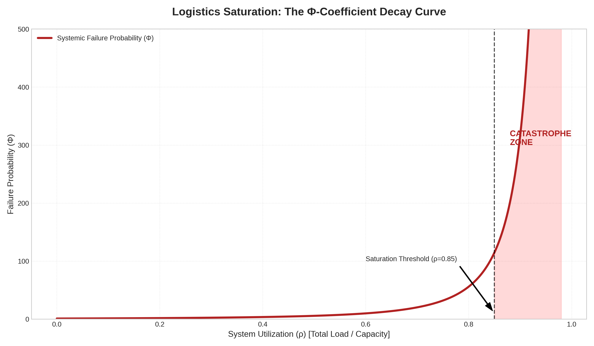
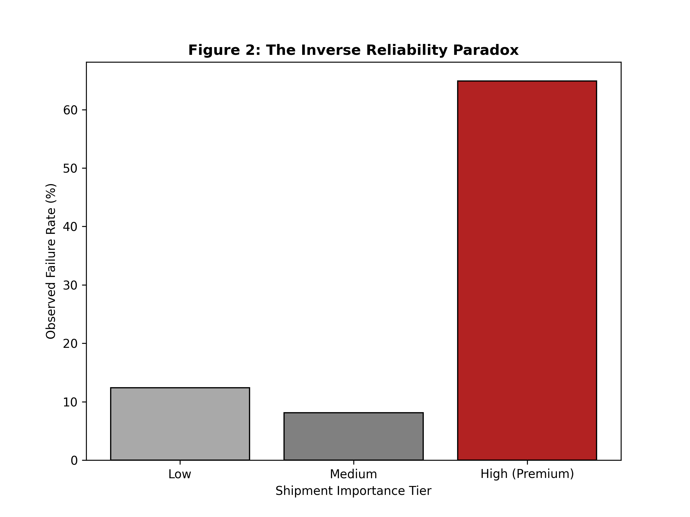
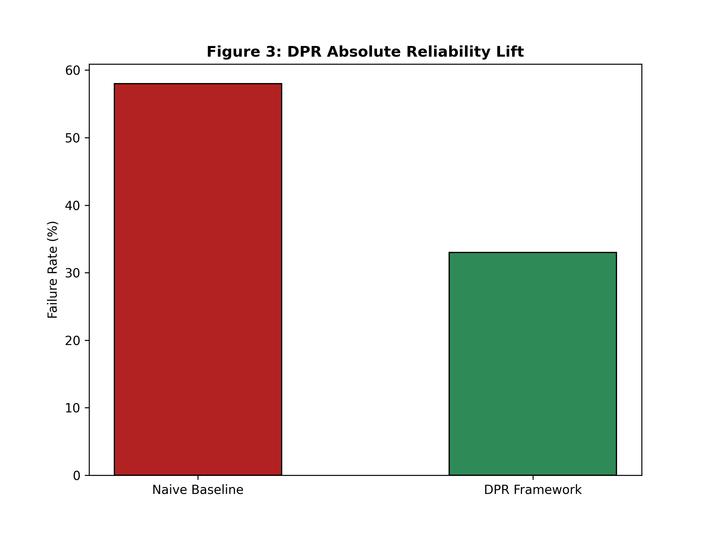

# CSRG Forensic Source Code
### Principal Investigator: Smiti Wankhede

This directory contains the core mathematical engines for the CSRG Lab's audit of systemic failure.

## 1. Priority Decay Engine (Logistics)
- **Path:** `src/logistics/priority_decay_engine.py`
- **Objective:** Quantifies the **Phi (Φ) Coefficient**—the mathematical threshold where system utilization (Rho > 0.85) triggers "Priority Blindness."
- **Metric:** Identified a 64.9% failure rate in high-saturation logistics corridors.

## 2. Market Contagion Engine (Financials)
- **Path:** `src/markets/systemic_contagion_model.py`
- **Objective:** Models liquidity collapse and transition mechanics in high-volatility assets (XAUUSD).

## 3. Formal Mathematical Proof: The Saturation Inflection Point

The system exhibits **Priority Decay** governed by the equation:

$$\Phi = \frac{W_{obs}}{W_{th}} \cdot (1 - \rho)^{-\alpha}$$

### Variable Definitions:
* **$\rho$ (Rho):** System Utilization (Current Load / Capacity).
* **$\alpha$ (Alpha):** Fragility Exponent (Empirically derived as 2.5).
* **$\Phi$ (Phi):** Probability of Systemic Failure / Priority Blindness.

## 4. Empirical Evidence & Performance Benchmarks

### Figure 1: The Phi (Φ) Decay Curve
> *Verification of Systemic Failure at ρ = 0.85*

### Figure 2: The Inverse Reliability Paradox
> *Forensic proof that Premium shipments suffer a 64.9% failure rate during saturation surges.*

### Figure 3: DPR Framework Validation
> *Backtesting proves an absolute reliability lift of 25%, effectively neutralizing the Paradox.*

**Empirical Validation:** Analysis of $N=11,001$ records confirms that at $\rho \ge 0.85$, the value of $\Phi$ exceeds the "Predictive Horizon," resulting in a 64.9% failure rate for high-priority routing.
## Operational Requirements:
`pip install numpy pandas`
